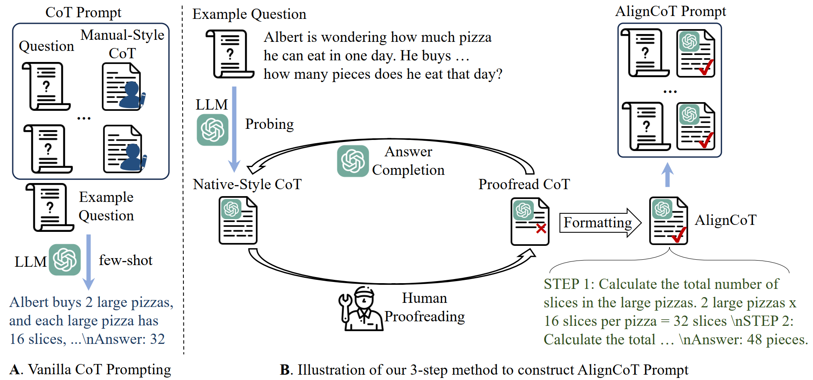
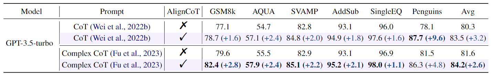
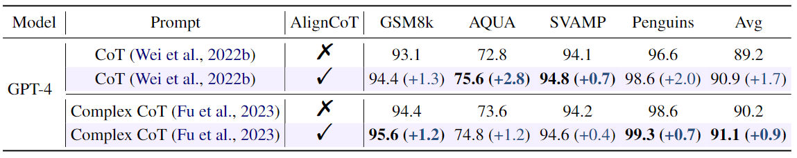

# Speak Like a Native: Prompting Large Language Models in a Native Style

This is the repo of our paper: [Speak Like a Native: Prompting Large Language Models in a Native Style](https://arxiv.org/abs/2311.13538).

## Framework

## Experimental Results

